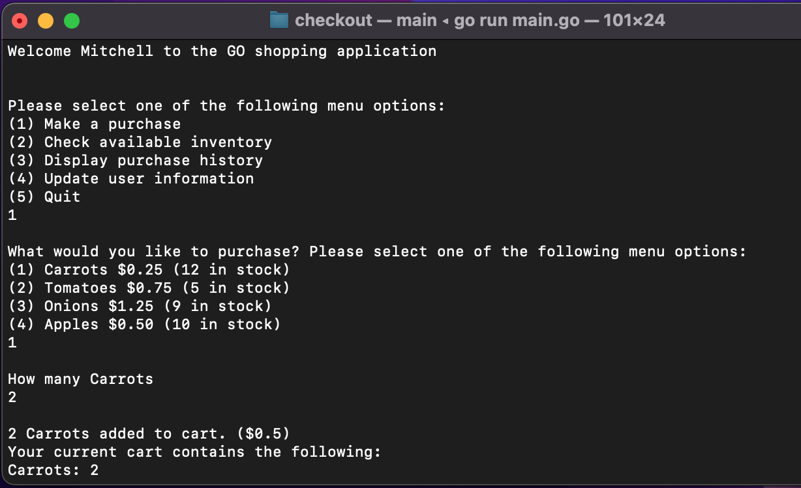
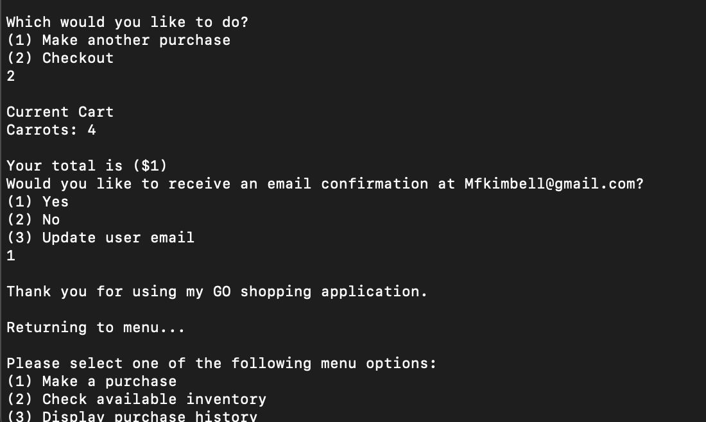
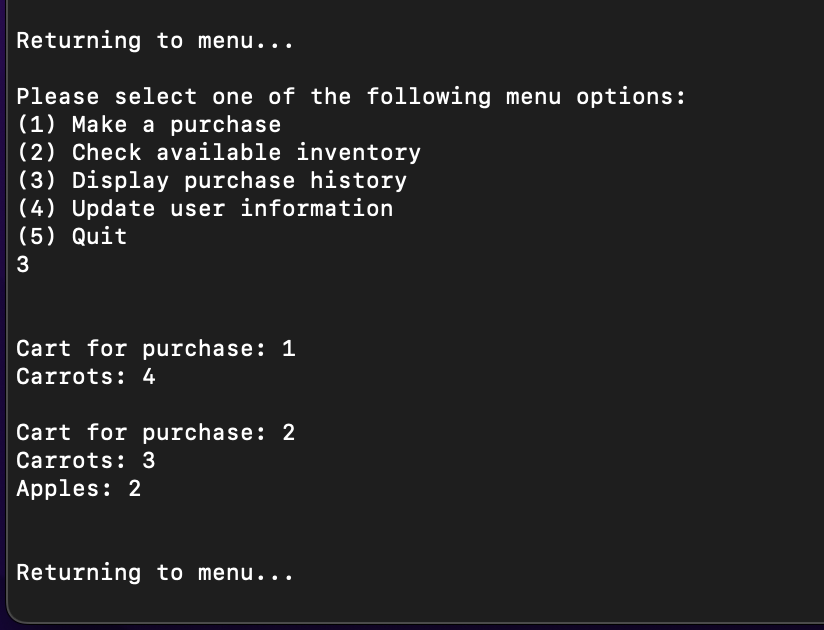

# GO_ShoppingApplication
This is a shopping application using things like maps, slices, for loops, and good code reusability

Menu:

Introduction/UserInput:

First Checkout:

Second Checkout (multiple different items):
.png)
Displaying Purchase History:

Displaying Available Inventory:

Interesting problems:

I had to learn to clear a map with a for loop because I wanted to clear the customer's cart after each purchase so I could log each purchase they make. The "DisplayPurchases" option tells the customer everything they've previously purchased, but keeps the inventory available updated. Additionally, I logged the purchases with string concatenation of each purchase details. 

Currently, the program will not let the customer buy more inventory than is available, and if a customer chooses to buy the same item multiple times during the same cart session, it will add the current objects. Additionally, I made it only shows things being purchased in the cart and not the entire inventory, with things not purchased set to 0. 

This program also displays cost of items in cart and total at checkout. 

I learned about GO's maps, slices, for loops, flags, type conversions, user input scanner, importing packages such as fmt for printing, and keeping variables accessible with functions without use of setters and getters like i'm used to currently with java.

